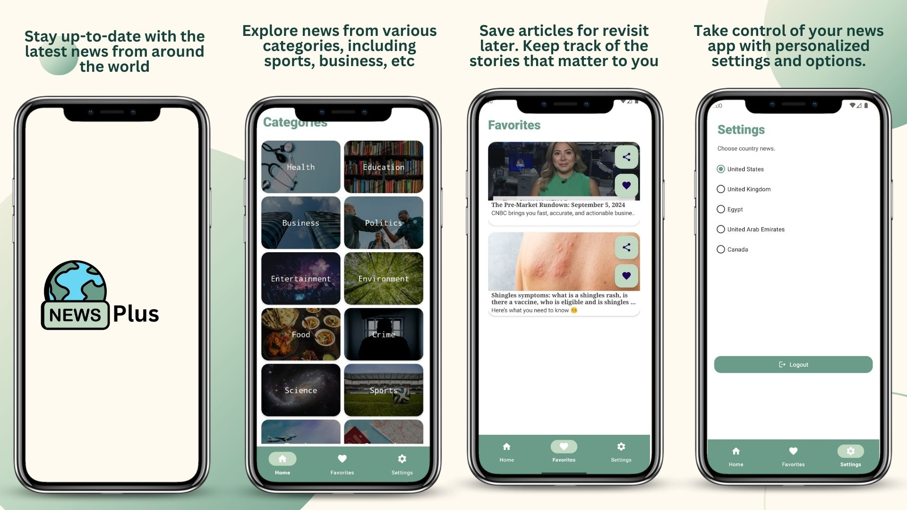

# NewsPlus 
is a news app built by kotlin and android SDK for android applications 

# This app demonstrates fundamental Android development concepts including:
- User interface creation with XML layouts
- using list item
- recycler viwes
- adapter
- Fragments
- intents
- API by retrofit2
- using News API from newsapi.org
- shared preferences 
- lottie library for animation
- firebase authenication
- firebase store 

# Key features:
- create account and save your favourite headlines
- choose specific country news
- choose news from varios categories

# App snapshots

